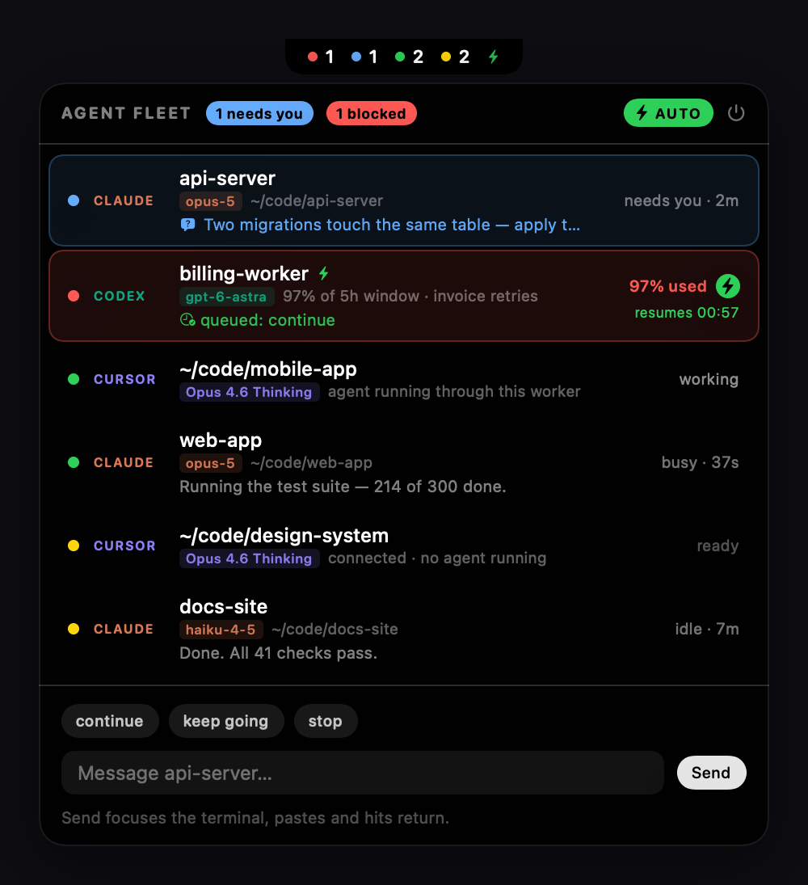

# Agent Fleet HUD

A notch-resident HUD for the AI coding agents **already running** on your Mac.

It does not run, spawn or orchestrate agents. You start them however you
normally do — `claude`, `codex`, Cursor — and this watches them: which is
working, which is waiting on an answer, which is out of usage window and when
it comes back. You can message one without leaving what you are doing.



*Rendered from the real panel with sample agents — `./make-screenshot.sh`.*

Collapsed, it's a small black tab hanging under the notch with live counts:
red = blocked by the usage limit, blue = needs your input, green = working,
amber = idle and waiting on you, slate = up but we cannot tell. It appears
only while something is running and hides itself completely when nothing is.

Hover it to slide open the panel. Click the tab to pin it open (pinning also
gives it keyboard focus so you can type a message).

## What it detects

Nothing is hardcoded to one machine: apps are located by bundle identifier
rather than assumed to be in `/Applications`, the build targets whatever
architecture you build on, and every path is derived from your home directory.

| Source | How | Busy/idle | Send a message | Stop |
|---|---|---|---|---|
| Claude Code | `~/.claude/sessions/*.json` | yes, real status | yes, exact session | yes |
| Cursor | `cursor-agent` worker processes | no — see below | yes, newest chat in the workspace | yes |
| Codex | the `codex` process — ChatGPT.app's `app-server` or the standalone CLI | no — see below | yes, most recent thread | yes |

## Messaging

Nothing here takes your focus. The message goes on the clipboard and the paste
and return keys are posted straight to the target process with
`CGEventPostToPid`, so the app never comes to the front — you keep working
where you are while the message lands.

That needs Accessibility permission, because synthesising key events is what
macOS gates. It does *not* need Automation: System Events is not involved.
Without the permission the app says so in the header (**ALLOW TYPING**) rather
than failing quietly, and falls back to leaving the text on your clipboard.

Per source:

- **Claude, background sessions** (`claude --bg`) — `claude --resume <id> -p`
  delivers directly. No terminal UI to conflict with, so driving one
  headlessly is the intended model, and the autopilot can use it unattended.
- **Claude, interactive sessions** — paste + return posted to the terminal's
  process. `claude --resume -p` is *not* used: it starts a second process
  against the same session id, so the reply lands in a log you never see while
  appending to the transcript the live TUI is writing. That is forking the
  conversation, not sending a message. Claude Code exposes no local delivery
  API for a live session — no `send` subcommand, `claude agents` has no
  messaging option, and the `messagingSocketPath` socket answers none of
  newline-JSON, length-prefixed JSON, HTTP/1.1 or the HTTP/2 preface, with a
  token file beside it implying a handshake.
- **Codex** — `codex queue --thread <id> --message`, a real API, no typing.
- **Cursor** — `⌘L` then paste + return posted to Cursor's process. The chat
  has to be focused first or the paste would land in an open file and edit
  your code.

Two timing details that were learned by getting them wrong:

- A full second passes between paste and return. Claude Code reads a bracketed
  paste as one batch, and a return arriving sooner is swallowed with it — the
  text appears in the prompt and sits there.
- The same text to the same agent within four seconds is refused as a
  duplicate. SwiftUI fires a `TextField`'s `onSubmit` on focus changes as well
  as on return, so one keypress could send twice: paste, submit, then paste
  again into the emptied prompt.

Every attempt is appended to `~/.notch-fleet/logs/send.log` — `SEND`, `POST`,
`CLI`, `CLIP`, `DUPE`, `SKIP`, `FAIL`, `HUNG` — because a keystroke going
somewhere unintended looks exactly like nothing happening.

### Which tab

Aiming matters as soon as you have two agents in one app, and it fails
silently when it goes wrong — so delivery uses the most precise route
available, in this order:

1. **A scriptable terminal, by tab.** Ghostty, Terminal.app and iTerm2 are
   recognised by bundle identifier. Ghostty is told
   `input text … to <terminal>`, matched on that terminal's working directory
   (its dictionary exposes no tty, so the directory is the key), then
   `send key "enter" to <terminal>` to submit. Those are deliberately two
   different commands: `input text` is documented as inputting text "as if it
   was pasted", so a newline inside it — LF or CR — is pasted content and
   never Enter. Sending the text that way put it in the correct tab and left
   it sitting there unsent; only a real key event submits. Terminal.app and
   iTerm2 are matched on the agent's `tty`, which is exact. The iTerm2 path is
   written from its scripting dictionary but untested — iTerm was not
   installed on the machine this was built on, so it falls back if the session
   cannot be found. Terminal.app
   gets `do script … in <tab whose tty is …>`, matched on the agent's
   controlling terminal, which is exact. No focus, no clipboard, correct with
   any number of tabs open.
2. **Posted key events to the app.** Any other terminal. These reach whatever
   tab is *focused*, so if two agents share that app it refuses and leaves the
   text on the clipboard rather than delivering to the wrong one.
3. **Focus first, then keys.** Electron apps — Cursor, and any Electron-based
   editor or terminal — because Chromium only routes keys to its renderer for
   the key window. Posting to a background Cursor logged a clean send and did
   nothing at all. Detected from the bundle (`Electron Framework.framework`),
   not from a list of app names.

Route 3 cannot be aimed at a particular chat, and route 2 cannot be aimed at a
particular tab. Only route 1 is exact.

## Notifications

A HUD only works while you are looking at it, which is the opposite of what
"an agent needs you" requires. So transitions are announced: an agent starting
to ask you something, an agent hitting its limit, an agent whose window reset,
and a scheduled message firing.

Only transitions, never states — a blocked agent stays blocked for hours, and
repeating that every poll would be unusable.

## Polling

Three seconds while anything is mid-turn or waiting on you; fifteen when the
whole fleet is quiet. The reading caches (limits, Codex usage, worker status)
mean most polls touch little.

## Only Claude has a real status

Claude Code publishes a live per-session `status` and keeps it current, so its
rows are genuinely busy / idle / needs-you / blocked.

Cursor and Codex do not, and it is worth being blunt about why, because the
tempting signals are all wrong:

- **Cursor** publishes a real *worker* status, and nothing about the
  conversation. Each `cursor-agent worker start` is launched with
  `--worker-api-socket`, and that socket serves `agent.v1.PrivateWorkerApiService`
  over cleartext HTTP/2 (Connect-RPC). `WatchStatus` returns the states from
  its own proto descriptor — `READY`, `CLAIMED`, `DISCONNECTED` — so a worker
  with an agent running through it (`CLAIMED`) is distinguishable from one
  sitting idle. That is the green dot on a Cursor row, and it is honest.

  What it cannot show is an agent waiting on *you*. Cursor agents are cloud
  agents: while one waits for your answer nothing executes locally, so the
  worker is genuinely `READY`. Tested against three workers in three known
  states at once — one mid-question, one finished twenty minutes earlier, one
  that had never run anything — all three reported `READY`. That state lives
  on Cursor's servers.

  Everything else that looks like a signal is not one. The per-worker log is a
  30-second `Received frame` heartbeat and was byte-identical across those
  same three workers. CPU time is flat, because agents wait on the network.
  `glass.localAgentProjects.v1` maps workspaces to agents but its
  `lastUpdatedAt` was months stale. `agentKv` in `state.vscdb` is hundreds of
  thousands of content-addressed blobs with no timestamps, in a database that
  can reach tens of gigabytes — not something to query on a timer. Workspace
  file mtimes are worse than useless — measured against those three known
  states they came out *anticorrelated*, freshest for the worker running
  nothing and stalest for the one mid-question.

- **Codex** has no per-thread process at all. Thread recency comes from
  rollout file mtimes under `~/.codex/sessions`, which is the only source that
  keeps up — `session_index.jsonl` lags days behind, so it is used for thread
  titles only, never for timing. Either way, recency is not a turn status.

So both report **running** in slate, and the detail line carries the fact we
actually have — `worker attached`, or `last thread 3d ago · <name>`. They are
kept out of the green "working" count and sort last, because a slate row
carries no news. Green means an agent that really is mid-turn.

Getting this wrong is worse than saying nothing: a row that stays green after
its agent finished is a HUD that lies to you.

Messages still go through the documented CLI rather than that socket: the
socket serves only `GetWorkerId` and `WatchStatus`, so there is nothing to
send a message to there.

### Focusing one particular Cursor agent

Cursor builds its own deeplink — `cursor://anysphere.cursor-deeplink/background-agent?bcId=<id>`
— so focusing an exact agent is possible *if* you know the id. **Open** uses
it when Cursor recorded one, found by mapping the workspace through
`workspaceMetadata.entries` to a hash and then reading
`cursor/glass.tabs.v2/<hash>/…`, whose keys carry the agent id.

Usually there is no id, and that is not a bug in the lookup. Every local store
that once held the agent list appears to have stopped being written:
`cloudAgentRepository.agents`, `glass.cloudAgentProjects.v1` and
`glass.localAgentProjects.v1` were all months out of date when checked, and
only a minority of workspaces had an agent id recorded at all. A live agent's
identity appears to be known only to Cursor's servers. Checked and ruled out as well: the worker logs (no agent id in any
form), the worker's own RPC service, and the accessibility tree, which exposes
only nested unnamed groups with no rows to read or click.

Without an id, **Open** raises Cursor's existing window instead — never a new
one.

## Cursor workers

A Cursor row is one `cursor-agent worker start` process. It gets a row like
any other agent — green while an agent is running through it, amber when it is
connected with nothing running.

Cursor rows never show a clock: a worker's age is process uptime, so
"running · 7h" made an idle worker look like an agent that had been grinding
all afternoon.

Reading those sockets needs an HTTP/2 client, which `URLSession` cannot
provide over a unix socket, so `Sources/CursorWorkers.swift` carries a minimal
one: one request per connection, response headers skipped rather than decoded
(no HPACK decoder), and requests encoded as literal header fields without
indexing (no dynamic table, no Huffman). About 4ms per worker, cached for 8s.

**Open** uses Cursor's bundled VS Code CLI with the workspace path, which
focuses the window already holding that folder. `open -a Cursor <folder>`
goes through Launch Services and opens a second window instead, which is not
what "open the agent" should mean.

## What each row shows

```
● CLAUDE   web-app                                 busy · 4m
           opus-5  ~/code/web-app
           Builds clean. Running the verification probe now.
```

- the state dot and, on hover, the actions
- the model actually doing the work. Claude's comes from the newest assistant
  turn in the transcript, so it is per session. Cursor and Codex keep the
  choice in their own config rather than per session, so that default is shown.
- the latest thing the agent said, always on screen

A row that needs you turns blue and floats to the top, showing the question
instead of the last message:

```
● CLAUDE   api-server                         needs you · 2m
           opus-5  ~/code/api-server
           ? Which database should we use?
```

That is detected from a tool call with no matching result — which covers both
`AskUserQuestion` and a plan sitting in review — or from an idle session whose
last words were a question. Its hover action is **Answer**, which aims the
composer at that row rather than sending a blind "continue".

A session that has actually been refused for hitting the limit turns red and
shows when it can work again, instead of how long it has been sitting there:

```
● CLAUDE   api-server                     limit reached
           opus-5  ~/code/api-server            back in 2h 14m
           You've hit your session limit · resets 2:10pm · progress saved
```

This is per session, not global: it comes from a `quotaLimits` rejection in
that session's own transcript, and only counts while the window it names is
still open and nothing has succeeded in that session since. A blocked row
offers no Continue button, because it would only fail.

## The usage window

There is no global window line. The Claude window is account-wide and Codex
has its own, so a single line at the top read as though it applied to the
whole fleet — including Codex, which it never did.

Instead a row carries its window only when that window is nearly gone: the
Codex row past 90% used, a Claude row with under 15 minutes left or a spent
window. Otherwise rows stay clean and the full numbers live in the details
block, one click away.

The Codex row shows how old its reading is (`96% of the 5h window (read 3h
ago)`), because that percentage only moves when Codex itself writes — a number
with no age could be from this morning.

**Codex reports its own usage**, and that is a real reading rather than an
estimate: it records the server's numbers into the rollout it is writing,
under `payload.rate_limits.primary` — a percentage, the window length and an
exact reset timestamp. The Codex row shows the percentage, and turns red with
its reset time once the window is effectively gone. The threshold for that is
a judgement call (95%), because Codex writes no "rejected" flag the way Claude
Code does, so the exact percentage is always shown next to it rather than
being rounded into a claim.

Those rollout files reach hundreds of megabytes, so only the tail of the few
most recently touched ones is read, and the result is cached.

Cursor reports no usage at all.

When you have actually hit a limit, Claude Code records the real `resetsAt` in
the transcript and that exact number is used. Otherwise it is derived from
message timestamps: a window is anchored to its first request floored to ten
minutes and runs five hours, and the next request after it expires opens a
fresh one. Derived readings are marked `est.` — checked against a recorded
`resetsAt`, the estimate lands on the same minute.

## Seeing the details

Click a row to open a details block above the composer: the full latest
message or pending question, model, state, how long it has been there, pid,
working directory and session or thread id. Text there is selectable, so an id
can be copied out. Click the row again, or **Close**, to collapse it.

It carries three ways out to the real thing:

- **Open <app>** — brings the agent's own window forward. The app is found by
  walking up the parent process chain to the first `.app` bundle, so a Claude
  session running under zsh under `login` under Ghostty resolves to Ghostty.
  For Cursor the workspace path is passed too, so it opens that project rather
  than whatever was last focused. Claude sessions land you in the right app
  but not the right tab — nothing published locally says which tab it is.
- **Transcript** — reveals the `.jsonl` this app reads, for the full history.
- **Log** — reveals the log for messages sent from here.

**Open** is also a hover action on every row, since it works for all three
sources.

## Actions

- **Send** — delivers your message. On an agent blocked by its usage window
  the same button and the same return key **schedule** it instead, and the
  label says so (`Schedule 23:42`); sending now could only fail.
- **Continue** — sends "continue" to that agent.
- **Answer** — shown instead when the agent is asking something; selects the
  row so you can type a real reply.
- **Stop** — `SIGINT`. Interrupts the current turn, session stays alive.
- **Quit** — `SIGTERM`. Ends the process. The conversation is kept on disk,
  so `claude --resume` still works afterwards.
- The composer at the bottom sends any text to the selected row. Click a row
  to select it; the `continue` / `keep going` / `stop` chips are shortcuts.

Everything runs as a detached process, so nothing steals focus from the
terminal you are in. Output goes to `~/.notch-fleet/logs/<session-id>.log`.

## Scheduling a message for a blocked agent

A blocked agent cannot be messaged now — the send would just fail — so the
composer offers to hold it instead. Select the blocked row, type the message,
and press **Schedule 18:41**. It is sent the moment that agent's window rolls
over. Leave the composer empty and click the bolt on the row for the quick
version, which sends `continue`.

The row then shows what is waiting:

```
● CODEX   codex app-server                      97% used
          gpt-6-astra  97% of the 5h window   resumes 18:41
          ⏱ queued: rerun the PCB checks and report
```

Pressing **Schedule** again replaces the queued message and keeps the time.
The bolt cancels it, and so does sending anything by hand — you handled it.

This is opt-in per row, deliberately. A blocked agent may be blocked on work
you abandoned on purpose, and quota should not be spent restarting it because
a global switch was on. Scheduling one row signs up that row and nothing else.

- It fires on the clock, not on the block clearing — the blocked reading only
  refreshes when the agent next writes, so waiting for it to clear would wait
  forever.
- 30 seconds past the reset, so the first request is not racing the rollover.
- The queue survives a restart, but an entry more than 30 minutes stale is
  dropped rather than firing the moment the app comes back.
- It runs whether or not the global **AUTO** switch is on.
- Messages are passed to the CLI single-quoted, so quotes, backticks and shell
  metacharacters in your text are carried through literally.

## Auto-continue

The **AUTO** switch in the panel header nudges idle Claude sessions with
"continue" so a fleet keeps moving while you are away. A bolt in the collapsed
tab means it is on, and every row it actually covers carries its own bolt —
so you can tell at a glance which agents are being nudged and which are on
their own. That bolt goes hollow (`bolt.slash`) once a session has used up its
nudges and is waiting on you.

The guards matter more than the feature, because a nudge loop with no brake
burns a whole usage window in an afternoon:

- only sessions with a real idle status, so only Claude
- **never** a session that is asking you something — answering a real question
  with "continue" makes the agent guess, which is worse than waiting
- a 25s grace period, so a turn that just ended is not immediately re-poked
- a 120s cooldown per session
- five nudges in a row per session, then it stops and waits. Sending anything
  by hand clears that count
- nothing at all once the usage limit is spent

## What it reads, and what it needs

Worth knowing before you run it, because it asks for a permission most apps do
not and it reads conversation data.

It reads, all locally, never over a network:

- `~/.claude/sessions/*.json` — which sessions are live, and their status
- `~/.claude/projects/**/*.jsonl` — transcripts, for the latest message, a
  pending question and recorded rate limits. **This is conversation content.**
- `~/.codex/sessions/**/rollout-*.jsonl` — Codex usage and thread activity
- Cursor's `state.vscdb` and its worker sockets — worker status, agent ids
- `ps` output — to find agents and the apps hosting them

It makes no network requests of its own. Everything it shows comes off your
own disk or from a local socket.

It needs **Accessibility** permission, because delivering a message to an
interactive agent means synthesising key events, which macOS gates. Without it
the app still works as a monitor and leaves messages on your clipboard
instead. Scripting a terminal to target one tab additionally triggers an
**Automation** consent prompt for that terminal.

`~/.notch-fleet/logs/send.log` records each delivery attempt with the first 80
characters of the message, so failures can be diagnosed. That is message
content on disk in plain text — delete the file or the directory if you would
rather not keep it.

## Known limits

These are constraints of what the tools publish locally, not things waiting to
be fixed, and it is better to read them here than discover them:

- **Cursor cannot be aimed at one agent.** `Open` raises Cursor's existing
  window; it cannot select the agent you clicked, and a message goes to
  whatever chat is focused. Cursor's own deeplink is used when an agent id
  happens to be recorded locally, which is uncommon — see the Cursor section.
- **Cursor cannot show "needs you".** An agent waiting on your answer runs
  nothing locally, so its worker honestly reports idle. That state lives on
  Cursor's servers.
- **Codex shows no turn status**, only a usage window — and that reading is
  only as fresh as the last time Codex wrote one, which is why its age is
  shown next to it.
- **iTerm2 support is untested.** It is written from iTerm's scripting
  dictionary and falls back safely, but iTerm was not installed on the machine
  this was built on.
- **Interactive Claude sessions cannot be driven unattended.** Auto-continue
  and scheduled messages only use routes that do not involve typing at a
  window, so they cover Codex and background (`claude --bg`) sessions.

## Tests

```sh
./test.sh
```

Needs only the Swift toolchain, same as the build. Most assertions encode
something that was once wrong: the usage-window formula is checked against a
reset Claude Code actually recorded, and there are guards for a send firing
twice from one keypress, a resume loop repeating every poll, and unattended
keystrokes landing in the wrong window.

## Build and run

```sh
./build.sh
open "build/Agent Fleet.app"
```

Requires the Swift toolchain that ships with Xcode. No dependencies.

`build.sh` signs with a real identity rather than ad-hoc. macOS ties every TCC
grant to code identity, and `codesign --sign -` mints a new one on every
build — so an Accessibility permission granted yesterday silently stopped
applying to today's binary, while the switch still looked enabled. Override
the identity with `FLEET_SIGN_IDENTITY` if needed.

The icon is generated from `Resources/icon.png` into `AppIcon.icns` on each
build.

Set `FLEET_OPEN=1` to launch with the panel already open, which is useful when
tweaking the layout.

Set `FLEET_DEMO=1` to show a sample fleet covering every state at once, for
checking the colours without waiting to hit a limit or for an agent to ask
something. Demo rows use a pid that cannot exist, so a misfired Stop or Quit
hits nothing, and auto-continue is not run against them.

```sh
FLEET_OPEN=1 FLEET_DEMO=1 "build/Agent Fleet.app/Contents/MacOS/AgentFleet"
```

## Start it at login

System Settings → General → Login Items → **+** → pick `build/Agent Fleet.app`.

It runs as an accessory app: no Dock icon, no app-switcher entry. Quit it with
the power button in the panel header.

## Layout

- `Sources/Discovery.swift` — finds agents, parses process, state and transcript files
- `Sources/Limits.swift` — the Claude usage window
- `Sources/CodexState.swift` — Codex threads and its reported usage
- `Sources/CursorWorkers.swift` — Cursor worker status, and the HTTP/2 client for it
- `Sources/TerminalDelivery.swift` — exact per-tab delivery for scriptable terminals
- `Sources/CursorAgents.swift` — workspace → cloud-agent id, for Cursor's deeplink
- `Sources/Notifier.swift` — transition notifications
- `Sources/Actions.swift` — send / interrupt / quit, per source
- `Sources/AutoPilot.swift` — auto-continue and its guards
- `Sources/UI.swift` — SwiftUI panel and notch tab
- `Sources/main.swift` — window placement, notch geometry, hover, polling
